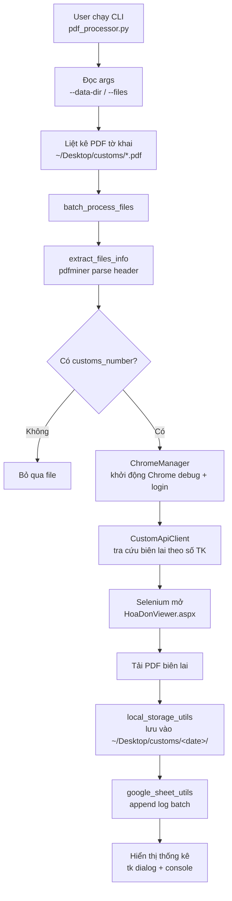
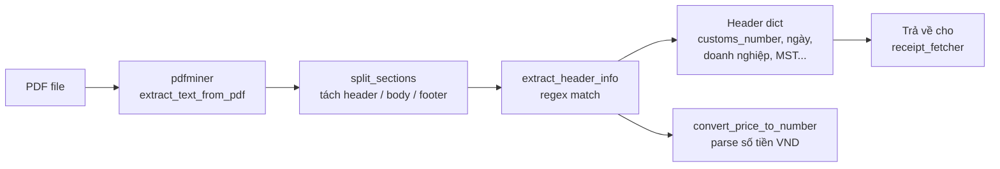
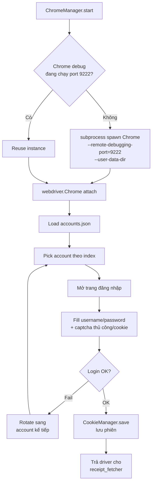
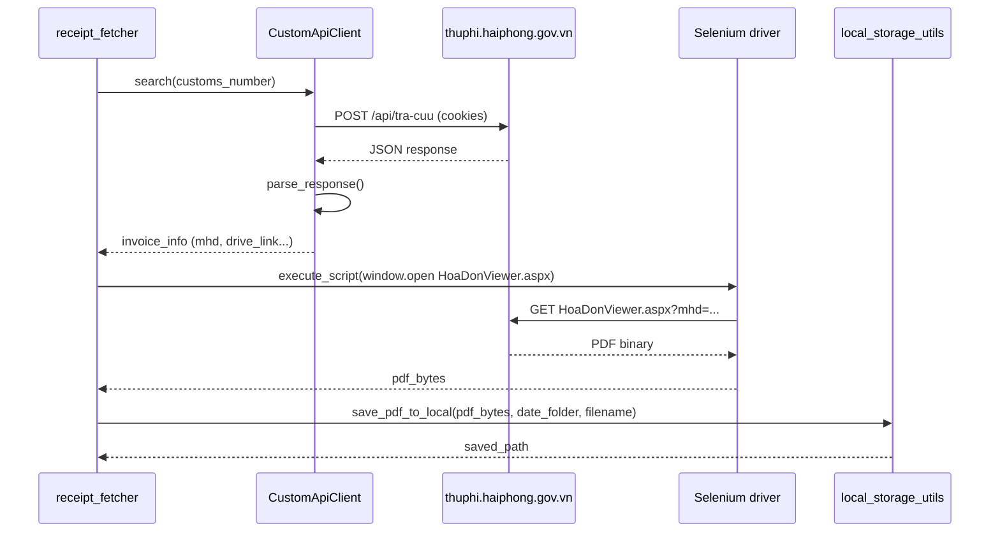
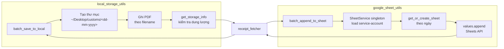
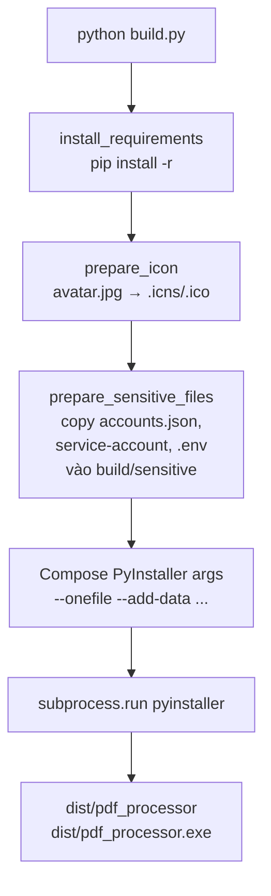

# PDF Invoice / Biên Lai Processor

Công cụ CLI tự động hóa quy trình lấy biên lai điện tử (hóa đơn) cho các tờ khai hải quan từ cổng `thuphi.haiphong.gov.vn`. Ứng dụng đọc các file PDF tờ khai, đăng nhập tự động bằng pool tài khoản, gọi API và Selenium để tải biên lai PDF tương ứng, lưu vào thư mục local theo ngày, và ghi log kết quả vào Google Sheet.

## Mục đích dự án

- **Đầu vào:** thư mục chứa PDF tờ khai hải quan (mặc định `~/Desktop/customs/`).
- **Xử lý tự động:**
  1. `pdf_invoice_parser` đọc header tờ khai bằng `pdfminer.six` để lấy `customs_number`, ngày đăng ký, tên doanh nghiệp, mã số thuế...
  2. `ChromeManager` khởi động Chrome ở chế độ remote-debug, đăng nhập cổng thuế bằng tài khoản trong `accounts.json` (rotate khi gặp lỗi).
  3. `CustomApiClient` gọi API tra cứu biên lai theo số tờ khai.
  4. Selenium mở `HoaDonViewer.aspx` để tải PDF biên lai gốc.
  5. `local_storage_utils` lưu PDF vào `~/Desktop/customs/<dd-mm-yyyy>/`.
  6. `google_sheet_utils` ghi log batch (mã tờ khai, biên lai, thời gian, trạng thái) lên Google Sheet.
- **Đầu ra:** PDF biên lai đã đặt tên chuẩn theo ngày + dòng log trên Google Sheet.

> Lưu ý: bản trước (`release-v1`..`v3`) là Flask web app + huấn luyện CNN/PaddleOCR giải captcha. Bản hiện tại (`release-v4`) đã chuyển sang **CLI batch processor** và bỏ pipeline OCR/captcha tự động.

## Kiến trúc tổng quan

### 1. End-to-end pipeline



### 2. PDF parsing (`pdf_invoice_parser.py`)



### 3. Chrome login pool (`chrome_manager.py`)



### 4. API + download biên lai (`custom_api_client.py` + `receipt_fetcher.py`)



### 5. Local storage + Google Sheet logging



### 6. Build pipeline (`build.py`)



Các module phụ trợ:
- `cookie_manager.py` — lưu/khôi phục cookie phiên đăng nhập.
- `utils.py` — helper path/date dùng chung; `get_default_customs_dir()` trả về `~/Desktop/customs`.
- `build.py` — đóng gói thành binary bằng PyInstaller.

## Yêu cầu hệ thống

- Python **3.10+** (project test với 3.10.10 trên Windows, Python 3 mặc định trên macOS).
- Google Chrome đã cài (ChromeDriver tự động tải qua `webdriver-manager`).
- macOS hoặc Windows. Linux có thể chạy nhưng chưa được test.
- (Tuỳ chọn) ODBC driver hệ thống nếu sử dụng `pyodbc` (`brew install unixodbc` trên macOS).

## Cài đặt

### macOS

```bash
git clone <repo-url>
cd img-extraction

python3 -m venv env
source env/bin/activate

pip install --upgrade pip
pip install -r requirements.txt
```

### Windows

```powershell
git clone <repo-url>
cd img-extraction

python -m venv env
.\env\Scripts\activate

pip install --upgrade pip
pip install -r requirements.txt
```

## Cấu hình trước khi chạy

1. **Tài khoản đăng nhập** — file `accounts.json` ở thư mục gốc, định dạng:
   ```json
   [
     { "username": "0123456789", "password": "Mat_khau_1" },
     { "username": "9876543210", "password": "Mat_khau_2" }
   ]
   ```
   `ChromeManager` sẽ duyệt qua từng tài khoản nếu một tài khoản fail. **Không commit file này.**

2. **Google Service Account** — bắt buộc nếu cần ghi log lên Sheet:
   - Tạo project trong Google Cloud Console, enable Google Sheets API.
   - Tạo Service Account → tải JSON key → đổi tên thành `driver-service-account.json`, đặt ở thư mục gốc.
   - Share spreadsheet `SPREADSHEET_ID` (định nghĩa trong `google_sheet_utils.py`) cho email của Service Account với quyền Editor.

3. **Thư mục input** — đặt PDF tờ khai vào `~/Desktop/customs/` (sẽ tự tạo nếu chưa có).

4. **(Tuỳ chọn) `.env`** — copy từ `.env.example` (nếu có) và set các biến môi trường cần thiết.

## Chạy ứng dụng

Kích hoạt venv rồi chạy CLI:

```bash
# Xử lý toàn bộ PDF trong ~/Desktop/customs
python pdf_processor.py

# Chỉ định thư mục input khác
python pdf_processor.py --data-dir /path/to/customs

# Chỉ xử lý các file cụ thể
python pdf_processor.py --files INV001.pdf INV002.pdf

# Tắt popup thông báo (chạy headless / scheduled job)
python pdf_processor.py --quiet
```

Khi chạy:
- Tool sẽ mở Chrome (remote-debug port `9222`) — đảm bảo đóng các Chrome instance khác trước.
- Đăng nhập tự động và tải biên lai về `~/Desktop/customs/<dd-mm-yyyy>/`.
- Cuối phiên hiển thị thống kê: tổng file, đã xử lý, thành công, thất bại.

## Build binary (PyInstaller)

Đóng gói thành executable một file để chạy trên máy không cài Python:

```bash
# macOS / Linux
python build.py

# Windows (giấu console window)
python build.py --no-console
```

`build.py` sẽ:
1. Cài lại requirements.
2. Convert `avatar.jpg` thành `icon.icns` (macOS) hoặc `icon.ico` (Windows).
3. Copy các file nhạy cảm (`accounts.json`, `driver-service-account.json`, `.env`) vào `build/sensitive/` rồi bundle vào binary.
4. Chạy PyInstaller với `--onefile` → output tại `dist/pdf_processor` (macOS) hoặc `dist/pdf_processor.exe` (Windows).

## Cấu trúc thư mục

```
img-extraction/
├── pdf_processor.py         # Entry point CLI
├── receipt_fetcher.py       # Pipeline chính (orchestration)
├── pdf_invoice_parser.py    # Parse PDF tờ khai (pdfminer)
├── chrome_manager.py        # Selenium + login pool
├── custom_api_client.py     # HTTP client cho API thuế
├── cookie_manager.py        # Quản lý cookie phiên
├── google_sheet_utils.py    # Ghi log lên Google Sheet
├── google_drive_utils.py    # (legacy) upload Drive
├── local_storage_utils.py   # Lưu PDF local theo ngày
├── utils.py                 # Helper path/date
├── build.py                 # PyInstaller build script
├── accounts.json            # Pool tài khoản đăng nhập (KHÔNG commit)
├── requirements.txt
├── static/                  # Icon, asset
└── tests:
    ├── test_local_storage.py
    └── test_rename_files.py
```

## Xử lý sự cố

- **Chrome không mở:** đóng toàn bộ Chrome đang chạy, xóa profile debug nếu treo.
- **Không tìm thấy `driver-service-account.json`:** tạo Service Account theo bước Cấu hình ở trên.
- **`pyodbc` build fail trên macOS:** `brew install unixodbc` rồi `pip install pyodbc` lại.
- **Selenium timeout/login fail:** kiểm tra tài khoản trong `accounts.json` còn hợp lệ, thử rotate.
- **Port 9222 bị chiếm:** kill Chrome instance đang dùng debug port.

## License

[MIT License](LICENSE)
